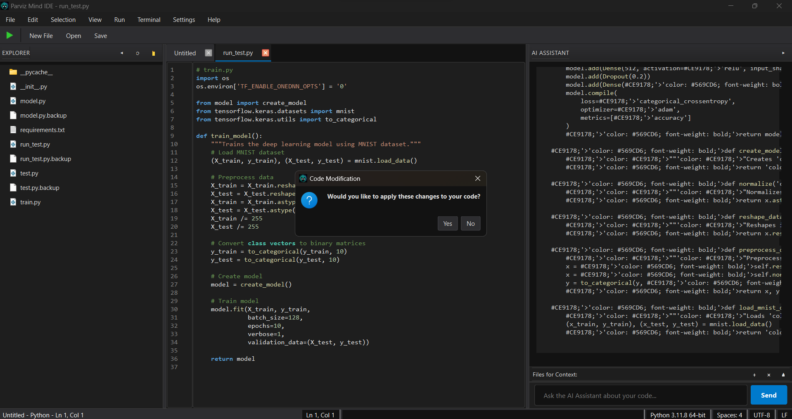
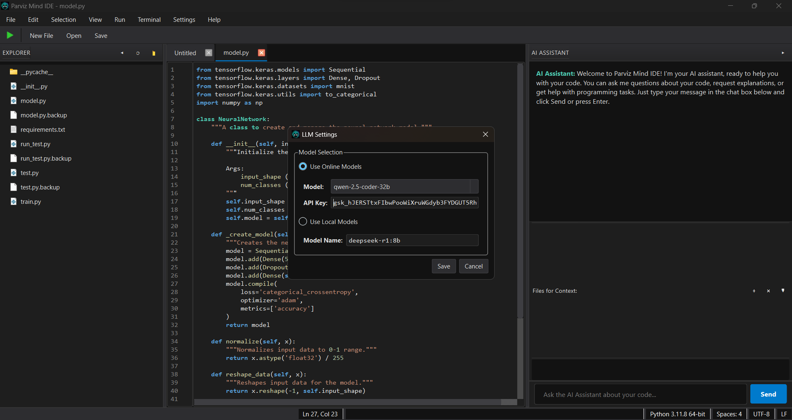

# Parviz Mind IDE

An intelligent Python IDE with integrated AI assistance that helps you write, understand, and refactor code.

## Screenshots

### Code Editor with AI Assistant

*The Parviz Mind IDE interface showing the code editor with syntax highlighting, file explorer, and the AI assistant chatbot panel*

### Settings Configuration

*The Settings dialog allows configuring AI models, including online Groq models or local Ollama models*

## Features

- Modern code editor with syntax highlighting and auto-completion
- Integrated AI assistant powered by either Groq or Ollama models
- File explorer with easy navigation
- Smart code suggestions and improvements
- Multi-file code generation and modification
- Command line interface with logging capabilities
- Customizable settings
- Beautiful dark theme interface
- AI-powered code assistance
- Interactive terminal
- Multiple file editing with tabs

## Building the Executable

### Prerequisites

- Python 3.8 or higher
- pip (Python package installer)

### Steps to Build

1. Install the required dependencies:
   ```
   pip install -r requirements.txt
   ```

2. Run the build script:
   ```
   python build.py
   ```

3. The executable will be created in the `dist` directory.

## Running the Application

Simply double-click the `ParvizMindIDE.exe` file in the `dist` directory.

## Development

If you want to run the application in development mode:

```
python src/main.py
```

## License

This project is proprietary software.

## Credits

Developed by Amir Mehdi Parviz

## AI Model Configuration

### Using Groq (Online Model)

1. Sign up for a Groq account at [groq.com](https://console.groq.com) to obtain an API key
2. In the IDE, go to Settings → LLM Settings
3. Select "Use Online Models"
4. Choose your preferred model from the dropdown
5. Enter your Groq API key
6. Click "Save"

The following models are supported through Groq:
- deepseek-r1-distill-llama-70b
- llama-3.3-70b-versatile
- gemma2-9b-it
- qwen-2.5-coder-32b
- mistral-saba-24b

### Using Ollama (Local Model)

1. Install Ollama on your system:
   - For Windows: Download from [ollama.com](https://ollama.com/download)
   - For macOS: `brew install ollama`
   - For Linux: `curl -fsSL https://ollama.com/install.sh | sh`

2. Pull your preferred model:
   ```bash
   ollama pull deepseek-r1:8b  # Or another model of your choice
   ```

3. Start the Ollama service:
   ```bash
   ollama serve
   ```

4. In the IDE, go to Settings → LLM Settings
5. Select "Use Local Models"
6. Enter the model name (e.g., `deepseek-r1:8b`)
7. Click "Save"

## Usage

- **Open Files**: Use File → Open or Ctrl+O
- **Save Files**: Use File → Save or Ctrl+S
- **Ask the AI Assistant**: Type your question in the chat input at the bottom and press Enter
- **Apply AI Suggestions**: When the AI suggests code changes, you can preview and apply them
- **Change Model Settings**: Go to Settings → LLM Settings

## Development

### Project Structure

- `src/` - Source code
  - `ui/` - User interface components
  - `services/` - Backend services including LLM integration
  - `utils/` - Utility functions
- `logs/` - Application logs

## License

This project is licensed under the MIT License - see the LICENSE file for details.

## Contributing

Contributions are welcome! Please feel free to submit a Pull Request.

## Acknowledgements

Built with:
- PyQt6
- LangChain
- Groq API
- Ollama 